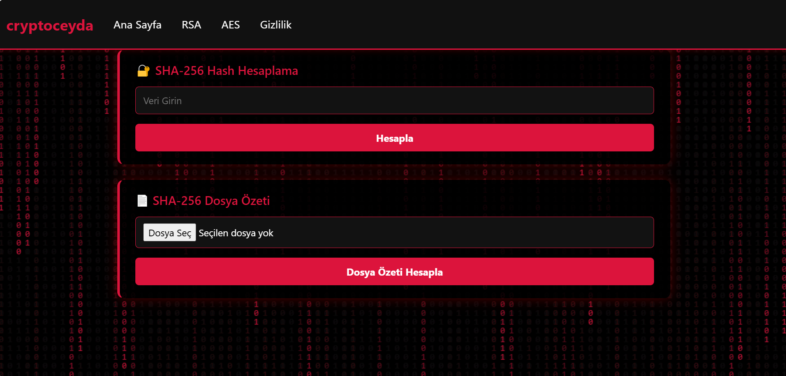
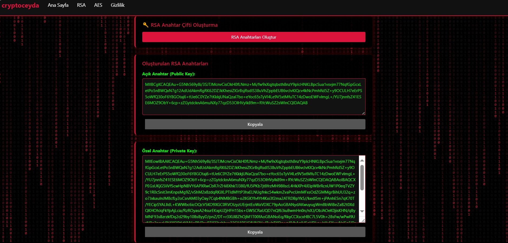
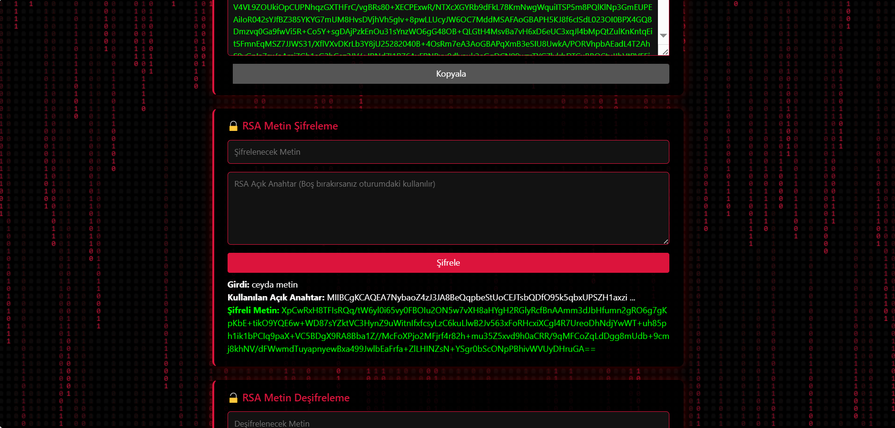
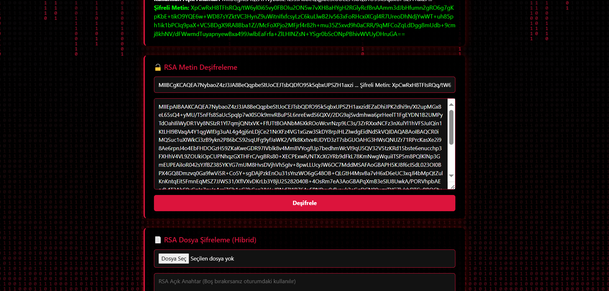

## CryptoCeyda

**CryptoCeyda**, Bilgi Güvenliği ve Kriptoloji dersi kapsamında geliştirdiğim, hem metin hem de dosya şifreleme/deşifreleme işlemlerini güvenli ve pratik bir şekilde gerçekleştirmeyi amaçlayan bir web uygulamasıdır.

### Projenin Amacı ve Geliştirilme Nedeni

Bu projeyi hem teorik bilgimi pratiğe dökmek hem de modern şifreleme algoritmalarının gerçek hayatta nasıl kullanılabileceğini göstermek amacıyla geliştirdim. Amacım, kullanıcıların hem metin hem de dosya tabanlı verilerini kolayca şifreleyip çözebileceği, sade ve anlaşılır bir arayüze sahip, güvenli bir uygulama ortaya koymaktı.

### Kullanılan Teknolojiler

- **.NET 6 / ASP.NET Core MVC:** Uygulamanın sunucu tarafı ve web arayüzü için.
- **C#:** Tüm iş mantığı ve kriptografi işlemleri için ana programlama dili.
- **Razor View Engine:** Dinamik HTML sayfalarının oluşturulması için.
- **JavaScript:** Anahtar ve IV üretimi, kopyalama işlemleri ve kullanıcı etkileşimi için.
- **Bootstrap:** Modern ve responsive (mobil uyumlu) arayüz tasarımı için.
- **System.Security.Cryptography:** RSA ve AES algoritmalarının güvenli şekilde uygulanması için .NET’in yerleşik kriptografi kütüphanesi.
- **Git & GitHub:** Sürüm kontrolü ve kod paylaşımı için.

### Projenin İşlevleri

- **RSA Anahtar Çifti Oluşturma:** Kullanıcılar, tek tıkla kendi RSA açık ve özel anahtar çiftlerini oluşturabilir.
- **RSA ile Metin Şifreleme/Deşifreleme:** Girilen metinler, RSA algoritması ile güvenli bir şekilde şifrelenip çözülebilir.
- **RSA ile Dosya Şifreleme/Deşifreleme (Hibrit Yöntem):** Büyük dosyalar için hibrit şifreleme (AES+RSA) kullanılır. Dosya, rastgele üretilen bir AES anahtarı ile şifrelenir; bu anahtar ve IV ise RSA ile şifrelenerek güvenli aktarım sağlanır.
- **AES Anahtar ve IV Üretimi:** Uygulama içerisinde güvenli ve rastgele AES anahtarı ve IV (Initialization Vector) otomatik olarak üretilebilir.
- **AES ile Metin ve Dosya Şifreleme/Deşifreleme:** Simetrik şifreleme algoritması olan AES ile hem metin hem de dosya şifreleme/deşifreleme işlemleri yapılabilir.
- **Kullanıcı Dostu ve Modern Arayüz:** Sade ve anlaşılır arayüz sayesinde, teknik bilgi gerektirmeden tüm işlemler kolayca gerçekleştirilebilir.
- **Hata ve Bilgilendirme Mekanizması:** Eksik veya hatalı girişlerde kullanıcıya bilgilendirici uyarılar gösterilir.

---

**CryptoCeyda**, hem kriptografi öğrenmek isteyenler hem de günlük hayatta veri güvenliğine önem veren kullanıcılar için pratik ve güvenli bir çözüm sunar.

---
###EKRAN GÖRÜNTÜLERİ

### ANASAYFA

Anasayfamız bu şekilde gözüküyor.

### SHA-256 HASH HESAPLAMA

Bu ekranda, kullanıcı metin kutusuna istediği bir veriyi (örneğin "merhaba ben ceyda") girip Hesapla butonuna tıkladığında, SHA-256 algoritması ile bu verinin hash (özet) değeri hesaplanır ve ekranda gösterilir.

### SHA-256 Dosya Özeti Hesaplama

Bu ekranda, kullanıcı bilgisayarından bir dosya seçerek o dosyanın SHA-256 algoritması ile özetini (hash değerini) hesaplayabilir.
Kullanıcı "Dosya Seç" butonuna tıklayarak istediği dosyayı seçer ve ardından "Dosya Özeti Hesapla" butonuna basar.
Seçilen dosyanın adı ve SHA-256 ile üretilen hash değeri ekranda gösterilir.
Bu özellik, dosyanın bütünlüğünü doğrulamak veya dosya değişikliklerini tespit etmek için kullanılır.

### RSA Anahtar Çifti Oluşturma

Bu ekranda, "RSA Anahtarları Oluştur" butonuna tıklayarak yeni bir RSA anahtar çifti (açık anahtar ve özel anahtar) oluşturabilirsiniz.
Oluşturulan anahtarlar ekranda ayrı ayrı gösterilir ve yanlarındaki "Kopyala" butonları ile kolayca panoya kopyalanabilir.
Bu anahtarlar, metin veya dosya şifreleme/deşifreleme işlemlerinde kullanılmak üzere oturumda saklanır.

### RSA Metin Şifreleme

Bu ekranda, kullanıcı şifrelemek istediği metni ve (isterse) kullanmak istediği RSA açık anahtarını girer.
"Şifrele" butonuna tıkladığında, girilen metin RSA algoritması ile şifrelenir ve ekranda şifreli metin ile birlikte kullanılan açık anahtarın bir kısmı gösterilir.
Bu özellik, hassas metinlerin güvenli bir şekilde şifrelenmesini ve başka bir tarafa güvenle iletilmesini sağlar.

### RSA Metin Deşifreleme

Bu ekranda, kullanıcı şifreli bir metni ve ilgili RSA özel anahtarını girerek "Deşifrele" butonuna tıklar.
Uygulama, RSA algoritması ile şifreli metni çözer ve orijinal metni ekranda gösterir.
Bu özellik, daha önce RSA ile şifrelenmiş hassas verilerin güvenli bir şekilde geri elde edilmesini sağlar.

